<picture>
  <source media="(prefers-color-scheme: dark)" srcset="./images/dark/header_hello.png">
  
</picture>
<a href="https://isamin.kr"><picture>
  <source media="(prefers-color-scheme: dark)" srcset="./images/dark/header_repositories.png">
  
</picture></a>

<a href="https://git.gold/KR-isamin/github-readme-sync" target="_blank"><picture>
  <source media="(prefers-color-scheme: dark)" srcset="./images/dark/repository_91.png">
  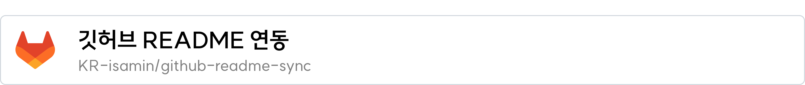
</picture></a>

<a href="https://git.gold/KR-isamin/2w.vc" target="_blank"><picture>
  <source media="(prefers-color-scheme: dark)" srcset="./images/dark/repository_4.png">
  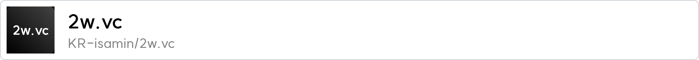
</picture></a>

<a href="https://git.gold/KR-isamin/morse" target="_blank"><picture>
  <source media="(prefers-color-scheme: dark)" srcset="./images/dark/repository_16.png">
  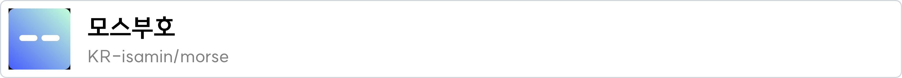
</picture></a>

<a href="https://git.gold/KR-isamin/dimigoin-surfing-front" target="_blank"><picture>
  <source media="(prefers-color-scheme: dark)" srcset="./images/dark/repository_34.png">
  
</picture></a>

<a href="https://git.gold/KR-isamin/rooftop-official-landing-page" target="_blank"><picture>
  <source media="(prefers-color-scheme: dark)" srcset="./images/dark/repository_82.png">
  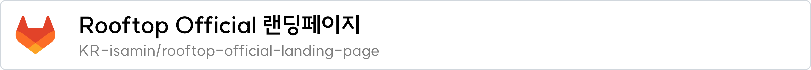
</picture></a>

<a href="https://git.gold/KR-isamin/jinseomyeon" target="_blank"><picture>
  <source media="(prefers-color-scheme: dark)" srcset="./images/dark/repository_88.png">
  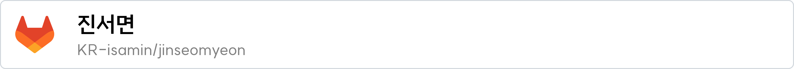
</picture></a>

<a href="https://git.gold/KR-isamin/comciganfast-front" target="_blank"><picture>
  <source media="(prefers-color-scheme: dark)" srcset="./images/dark/repository_85.png">
  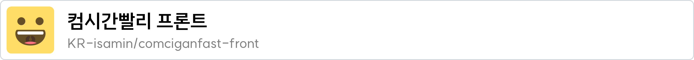
</picture></a>

<a href="https://git.gold/KR-isamin/ttiyong-ttiyong-woig-woig" target="_blank"><picture>
  <source media="(prefers-color-scheme: dark)" srcset="./images/dark/repository_3.png">
  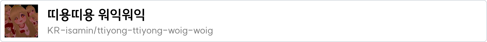
</picture></a>

<a href="https://git.gold/KR-isamin/dimigomeal-front" target="_blank"><picture>
  <source media="(prefers-color-scheme: dark)" srcset="./images/dark/repository_84.png">
  
</picture></a>

<a href="https://git.gold/KR-isamin/fonts" target="_blank"><picture>
  <source media="(prefers-color-scheme: dark)" srcset="./images/dark/repository_31.png">
  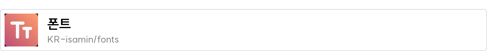
</picture></a>

<a href="https://git.gold/KR-isamin/linkfast-front" target="_blank"><picture>
  <source media="(prefers-color-scheme: dark)" srcset="./images/dark/repository_87.png">
  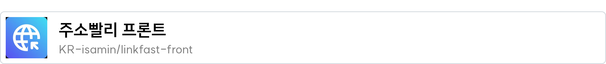
</picture></a>

<a href="https://git.gold/KR-isamin/dimigomeal-back" target="_blank"><picture>
  <source media="(prefers-color-scheme: dark)" srcset="./images/dark/repository_83.png">
  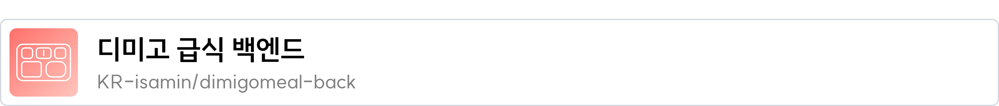
</picture></a>

<a href="https://git.gold/KR-isamin/portfolio" target="_blank"><picture>
  <source media="(prefers-color-scheme: dark)" srcset="./images/dark/repository_5.png">
  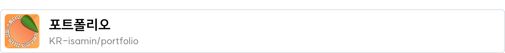
</picture></a>

<a href="https://git.gold/KR-isamin/dimigoin-surfing-back" target="_blank"><picture>
  <source media="(prefers-color-scheme: dark)" srcset="./images/dark/repository_38.png">
  
</picture></a>

<a href="https://git.gold/KR-isamin/dubidubab" target="_blank"><picture>
  <source media="(prefers-color-scheme: dark)" srcset="./images/dark/repository_25.png">
  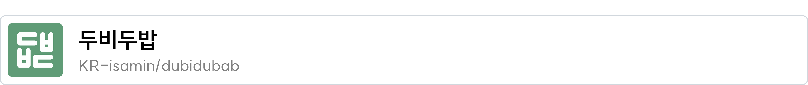
</picture></a>

<a href="https://git.gold/KR-isamin/youmefire" target="_blank"><picture>
  <source media="(prefers-color-scheme: dark)" srcset="./images/dark/repository_7.png">
  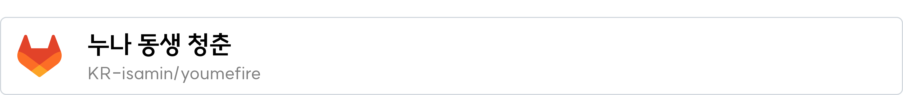
</picture></a>